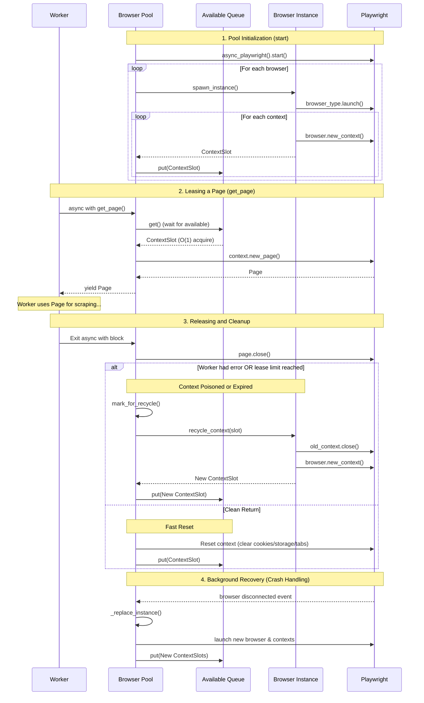

# Browser Pool Sequence Diagram

This diagram shows the lifecycle of the Playwright Browser Pool, including initialization, leasing pages to workers, and context recycling.

```mermaid
sequenceDiagram
    participant Worker
    participant Pool as Browser Pool
    participant Queue as Available Queue
    participant Instance as Browser Instance
    participant Playwright

    Note over Pool, Playwright: 1. Pool Initialization (start)
    Pool->>Playwright: async_playwright().start()
    loop For each browser
        Pool->>Instance: spawn_instance()
        Instance->>Playwright: browser_type.launch()
        loop For each context
            Instance->>Playwright: browser.new_context()
            Instance-->>Pool: ContextSlot
            Pool->>Queue: put(ContextSlot)
        end
    end

    Note over Worker, Playwright: 2. Leasing a Page (get_page)
    Worker->>Pool: async with get_page()
    Pool->>Queue: get() (wait for available)
    Queue-->>Pool: ContextSlot (O(1) acquire)
    Pool->>Playwright: context.new_page()
    Playwright-->>Pool: Page
    Pool-->>Worker: yield Page

    Note over Worker: Worker uses Page for scraping...

    Note over Worker, Playwright: 3. Releasing and Cleanup
    Worker->>Pool: Exit async with block
    Pool->>Playwright: page.close()
    
    alt Worker had error OR lease limit reached
        Note over Pool, Instance: Context Poisoned or Expired
        Pool->>Pool: mark_for_recycle()
        Pool->>Instance: recycle_context(slot)
        Instance->>Playwright: old_context.close()
        Instance->>Playwright: browser.new_context()
        Instance-->>Pool: New ContextSlot
        Pool->>Queue: put(New ContextSlot)
    else Clean Return
        Note over Pool, Queue: Fast Reset
        Pool->>Playwright: Reset context (clear cookies/storage/tabs)
        Pool->>Queue: put(ContextSlot)
    end

    Note over Pool, Playwright: 4. Background Recovery (Crash Handling)
    Playwright-->>Pool: browser disconnected event
    Pool->>Pool: _replace_instance()
    Pool->>Playwright: launch new browser & contexts
    Pool->>Queue: put(New ContextSlots)
```
