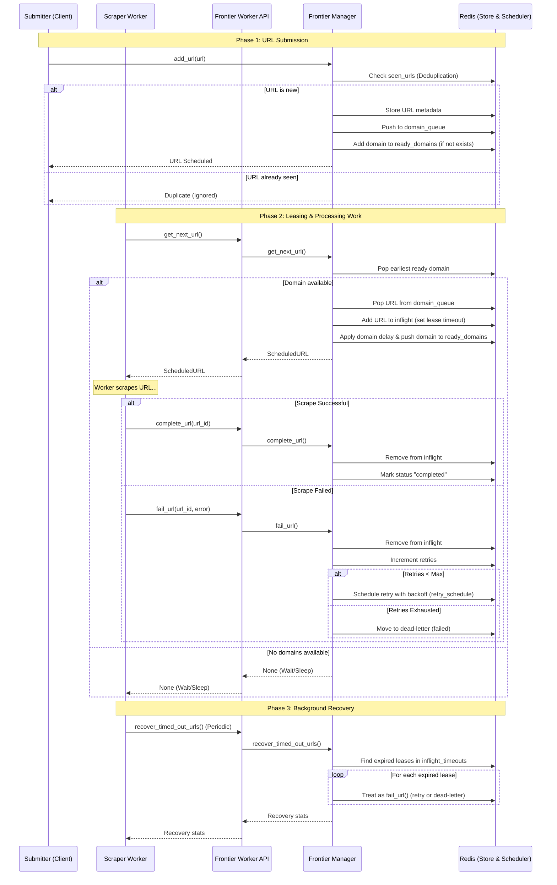

# Frontier Queue Sequence Diagram

This diagram shows the lifecycle of a URL going through the Frontier distributed queue.

```mermaid
sequenceDiagram
    participant Client as Submitter (Client)
    participant Worker as Scraper Worker
    participant API as Frontier Worker API
    participant Manager as Frontier Manager
    participant Redis as Redis (Store & Scheduler)

    Note over Client, Redis: Phase 1: URL Submission
    Client->>Manager: add_url(url)
    Manager->>Redis: Check seen_urls (Deduplication)
    alt URL is new
        Manager->>Redis: Store URL metadata
        Manager->>Redis: Push to domain_queue
        Manager->>Redis: Add domain to ready_domains (if not exists)
        Manager-->>Client: URL Scheduled
    else URL already seen
        Manager-->>Client: Duplicate (Ignored)
    end

    Note over Worker, Redis: Phase 2: Leasing & Processing Work
    Worker->>API: get_next_url()
    API->>Manager: get_next_url()
    Manager->>Redis: Pop earliest ready domain
    alt Domain available
        Manager->>Redis: Pop URL from domain_queue
        Manager->>Redis: Add URL to inflight (set lease timeout)
        Manager->>Redis: Apply domain delay & push domain to ready_domains
        Manager-->>API: ScheduledURL
        API-->>Worker: ScheduledURL
        
        Note over Worker: Worker scrapes URL...
        
        alt Scrape Successful
            Worker->>API: complete_url(url_id)
            API->>Manager: complete_url()
            Manager->>Redis: Remove from inflight
            Manager->>Redis: Mark status "completed"
        else Scrape Failed
            Worker->>API: fail_url(url_id, error)
            API->>Manager: fail_url()
            Manager->>Redis: Remove from inflight
            Manager->>Redis: Increment retries
            alt Retries < Max
                Manager->>Redis: Schedule retry with backoff (retry_schedule)
            else Retries Exhausted
                Manager->>Redis: Move to dead-letter (failed)
            end
        end
    else No domains available
        Manager-->>API: None (Wait/Sleep)
        API-->>Worker: None (Wait/Sleep)
    end
    
    Note over Worker, Redis: Phase 3: Background Recovery
    Worker->>API: recover_timed_out_urls() (Periodic)
    API->>Manager: recover_timed_out_urls()
    Manager->>Redis: Find expired leases in inflight_timeouts
    loop For each expired lease
        Manager->>Redis: Treat as fail_url() (retry or dead-letter)
    end
    Manager-->>API: Recovery stats
    API-->>Worker: Recovery stats
```
