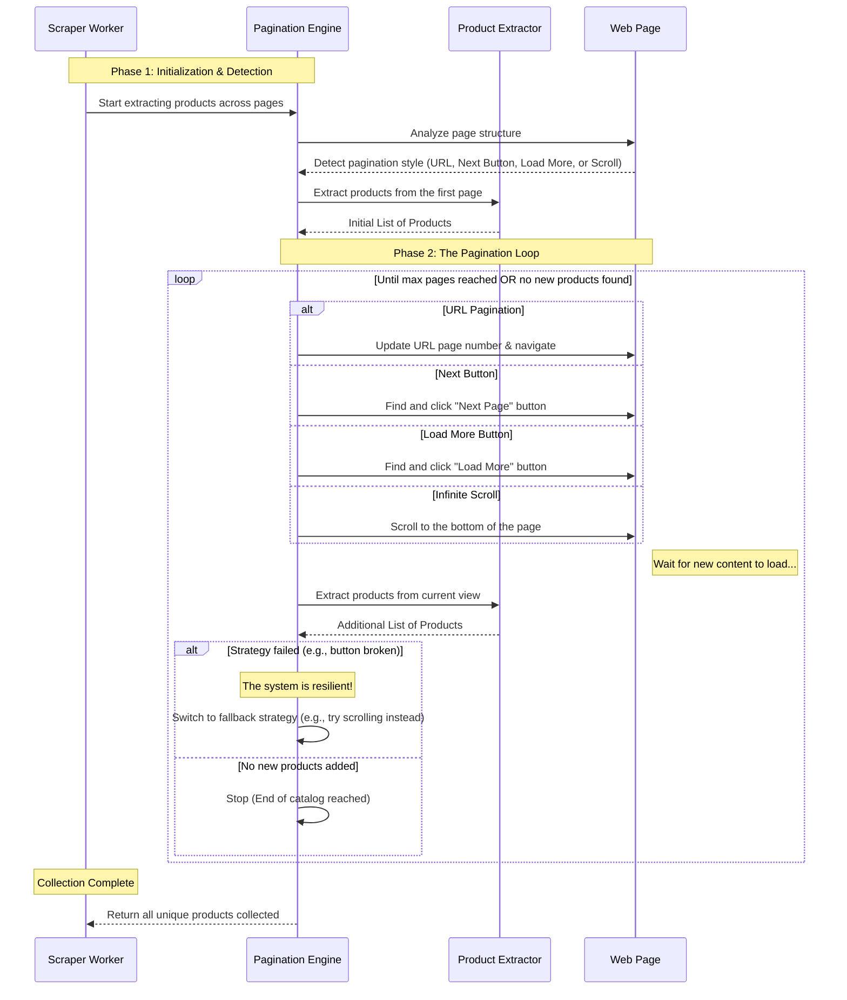

# Pagination Engine Sequence Diagram

This diagram provides an intuitive overview of how the Hybrid Pagination Engine navigates through multiple pages of products. It detects the type of pagination automatically and loops until all products are collected.

