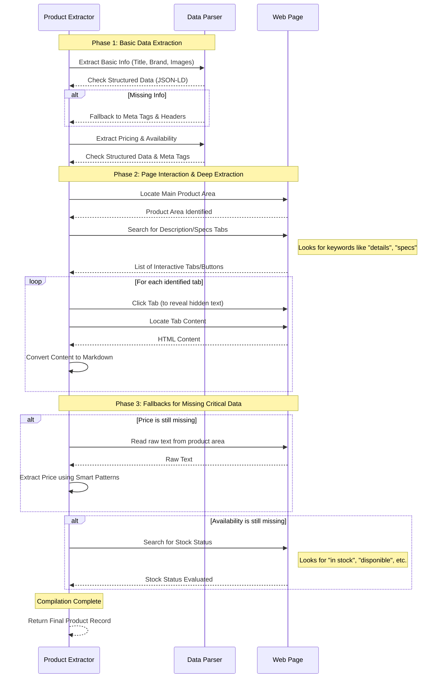

# Product Detail Extractor Sequence Diagram

This diagram provides an intuitive, high-level overview of how product details are extracted from a web page, starting with structured data and falling back to deep page interaction.

