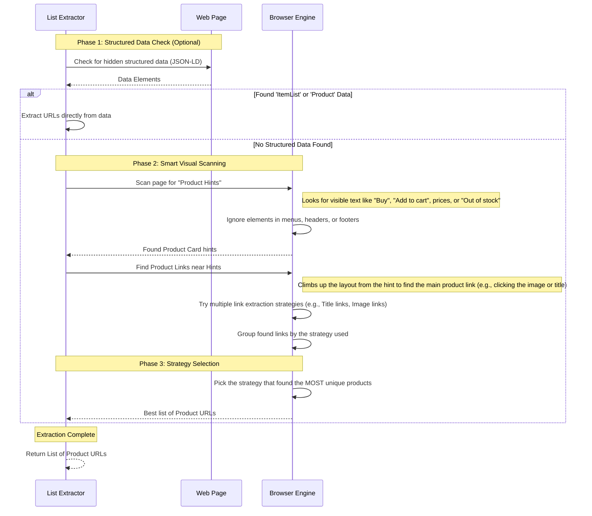

# Product List Extractor Sequence Diagram

This diagram provides an intuitive overview of how a list of products (like a category page or search results) is processed to extract individual product URLs. It shows how the system falls back to visually scanning the page if clean data isn't provided.

